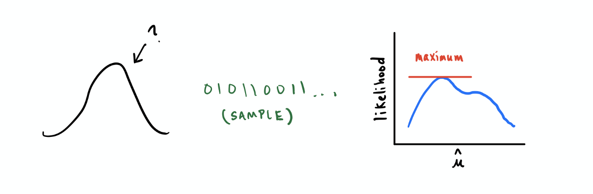

Estadística Computacional
===

### Inferencia estadística
###### Braulio Fuentes - Diego Quezada

---
# Temario
- Introducción
- Estimación puntual
    - Propiedades estimadores
    - Método de los momentos
    - Método de máxima verosimilitud (MLE)
- Intervalos de confianza

---

# Introducción

- El objetivo es sacar conclusiones sobre uno o más parámetros que definen la distribución.

- Seguimos trabajando bajo el supuesto IID.

- En particular estudiaremos inferencia paramétrica. Es decir vamos a inferir sobre modelos paramétricos de la forma $f(x; \theta): \theta \in \Theta$.

- Por ejemplo, para data proveniente de una distribución normal el modelo se define como $f(x; \mu, \sigma)$.

---

# Estimación puntual

La idea es obtener una única "mejor estimación" $\hat{\theta}$ de un estadístico de interés $\theta$.

Importante destacar que $\hat{\theta}$ es una función de la muestra $X_i$, es una **variable aleatoria**.

Dado un parámetro de interés $\theta$, existe más de un estimador razonable $\hat{\theta}$ generalmente. Se elegirá aquel que **mejor se desempeña** para cualquier muestra $X_i$.

La pregunta es cómo medir el desempeño :thinking:

---

## Características

### Estimador insesgado

Un estimador puntual $\hat{\theta}$ es un estimador **insesgado** de $\theta$ si $E[\hat{\theta}] = \theta$.
> Para estimadores sesgados es el sesgo es  $E[\hat{\theta}] - \theta$.

---

### Estimador consistente

Recordemos el mínimo error cuadratico:

$$
MSE = E[(\hat{\theta} - \theta)^2] = V[\hat{\theta}] + (E[\hat{\theta}] - \theta)^2
$$

> $\sqrt{V[\hat{\theta}]}$ se conoce como error estándar y $E[\hat{\theta}] - \theta$ como sesgo.

Un estimador es **consistente** cuando el sesgo y el error estándar tienden a cero a medida que $n \rightarrow \infty$.

---

### Estimador eficiente

Recordemos la cota de Cramer-Rao:

$$
V[\hat{\theta}] \geq \frac{1}{- E[\frac{\partial^2 \log(f(\underline{x}, \theta))}{\partial \theta^2}]} = \frac{1}{- nE[\frac{\partial^2 \log(f(x, \theta))}{\partial\theta^2}]}
$$

Un estimador es **eficiente** cuando su variaza es mínima, es decir cuando su varianza cumple la igualdad en la expresión anterior.

---

### Estimador suficiente

Un estimador es suficiente cuando es posible expresar la función de verosimilitud como:

$$
L( \underline{x}, \theta) = h(\hat{\theta}, \theta) \cdot g(\underline{x}) 
$$

En tal caso sabemos que el estimador está utilizando toda la información de la muestra.

---

## Método de los momentos

Supongamos una muestra extraída desde una distribución con $m$ parámetros. Para obtener $\hat{\theta}$ se deben igualar los primeros $m$ momentos muestrales con los poblacionales y resolver las ecuaciones.

---

## Método de máxima verosimilitud

Buscamos los parámetros $\theta_i$ que "más concuerdan" con los datos observados.

> Asegúrese de comprender la imagen de la primera slide.

Se maximiza la función de verosimilitud (likelihood):

$$
f(x_1, \dots, x_n ; \theta) = \prod_{i = 1}^n f(x_i ; \theta)
$$

> A la hora de realizar cálculos se suele maximizar el logaritmo natural de la función de verosimilitud.

---

### Propiedades EMV

1. Asintóticamente insesgado.
2. Asintóticamente normal.
    > $\frac{\hat{\theta} - \theta}{\sqrt{V[\hat{\theta}]}}  \rightsquigarrow N(0,1)$
3. Asintóticamente eficiente.
4. Invariante bajo transformaciones biunívocas.
    > Sea ${\hat{\theta}}$ el EMV de ${\theta}$, entonces para cualquier funcion $h({\theta})$ biunívoca, $h({\hat{\theta}})$ es el EMV.
5. Si existe un estimador suficiente, entonces EMV lo es.

---

# Intervalos de confianza

Las estimaciones puntuales no indican un grado de correctitud, no se sabe con qué probabilidad $\hat{\theta} = \theta$.

La alternativa es generar un intervalo $[\hat{\theta}_1, \hat{\theta}_2]$ en donde se sepa que el valor $\theta$ pertenece a este con un nivel de confianza (probabilidad) dado.

> Las ganancia de confiabilidad acarrea una pérdida de precisión.

---

## Algunos intervalos

### Intervalos para la media

Notación $P(z_{\frac{\alpha}{2}} \leq Z \leq z_{1 - \frac{\alpha}{2}}) = \gamma = 1 - \alpha$

1.  Con varianza conocida:
$$\left(\overline{x} + z_{\frac{\alpha}{2}} \cdot \frac{\sigma}{\sqrt{n}}, \quad \overline{x}  + z_{1 - \frac{\alpha}{2}} \cdot \frac{\sigma}{\sqrt{n}}  \right)$$

2.  Con varianza desconocida y $n$ "grande":

$$\left(\overline{x} + z_{\frac{\alpha}{2}} \cdot \frac{s}{\sqrt{n}}, \quad \overline{x} + z_{1 - \frac{\alpha}{2}} \cdot \frac{s}{\sqrt{n}}  \right)$$

---

Si la muestra no es "grande", se utiliza la distribución $t$ student con $n - 1$ grados de libertad donde $n$ es el tamaño de la muestra.

Notación $P(t_{\frac{\alpha}{2}, n - 1} \leq T \leq t_{1 - \frac{\alpha}{2}}, n - 1) = \gamma = 1 - \alpha$

3. Con varianza desconocida:

$$\left(\overline{x} + t_{\frac{\alpha}{2}, n - 1} \cdot \frac{\sigma}{\sqrt{n}}, \quad \overline{x}  + t_{1 - \frac{\alpha}{2}, n - 1} \cdot \frac{\sigma}{\sqrt{n}}  \right)$$

---

### Intervalo para la varianza

Es necesario una muestra proveniente de una **distribución normal**.

Notación $P(\chi^2_{\frac{\alpha}{2}, n -1} \leq \chi^2 \leq \chi^2_{1 - \frac{\alpha}{2}, n - 1}) = \gamma = 1 - \alpha$

- Utilizando la distribución chi cuadrado obtenemos: 
$$\left(\frac{(n - 1) S^2}{\chi_{1 - \frac{\alpha}{2}, n -1}}, \frac{(n - 1) S^2}{\chi_{\frac{\alpha}{2}, n -1}}  \right)$$

> Se puede obtener un intervalo para $\sigma$ tomando la raiz cuadrada del intervalo para $\sigma^2$ 

---

# Recomendaciones

1. https://towardsdatascience.com/understanding-maximum-likelihood-estimation-fa495a03017a
2. https://www.statology.org/confidence-intervals-python/ 