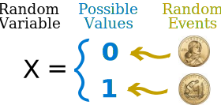
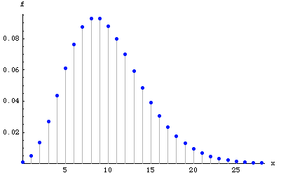
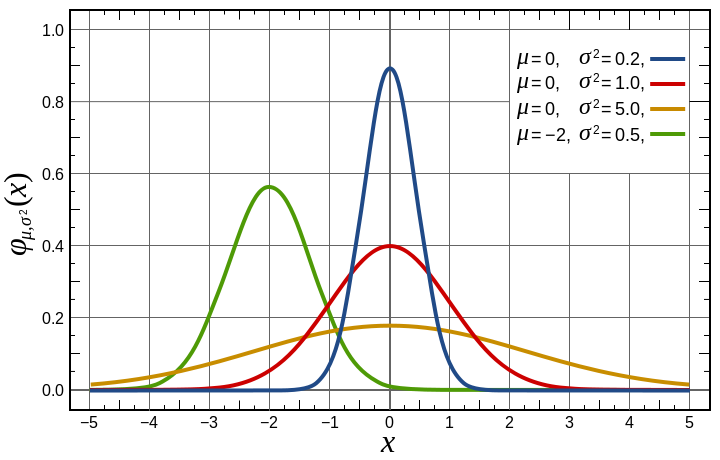

Estadística Computacional
===

### Variables Aleatorias :chart_with_upwards_trend::bar_chart:
###### Braulio Fuentes - Diego Quezada

---
# Temario
- ¿Que es una Variable Aleatoria?
- Tipos de Variables Aleatorias.
- Distribución de probabilidad.
- Función de Distribución Acumulativa.
- Valores Esperados y Varianza.
- Distribuciones Discretas.
- Distribuciones Continuas.

---
# ¿Que es una Variable Aleatoria?
Una variable aleatoria es una función que tiene como dominio el espacio muestral de un experimento y como rango tiene un conjunto de numero reales.

La notación $X(\omega) = x$ significa que $x$ es el valor asociado con el resultado $\omega$ por la v.a. $X$. 

> En el experimento de lanzar dos monedas, el espacio muestral viene dado por $\{CC,SS,CS,SC\}$. De esto modo podemos asociar a cada suceso del experimento el número de caras obtenidas, la v.a. Ahora el rango seria $\{0,1,2\}$ :coin:.

---
# Tipos de Variables Aleatorias.

Para variables con valores en $\mathbb{R}$ las variables aleatorias se clasifican usualmente en:

- **Discretas**. Es una variable aleatoria cuyos valores posibles constituyen un conjunto finito o pueden ser puestos en una secuencia infinita ordenada.
> Se sacan 2 bolas de una urna que contiene 4 rojas y 3 negras. Los posibles resultados la variable aleatoria, el número de bolas rojas, son $\{0,1,2\}$ :red_circle::black_circle:.

***
- **Continuas**. Es una variable aleatoria donde su conjunto de valores posibles se compone de todos los números que hay en un solo intervalo, extensión infinita. Además, ningún valor posible de la variable aleatoria tiene probabilidad positiva ($P(X = c) = 0$).

> Si consideramos como variable aleatoria el tiempo de espera, en horas, entre conductores sucesivos que exceden los límites de velocidad detectados, esta toma  todos los valores de  $x$  tales que  $x\ge 0$ :car::blue_car:. 

---
# Distribución de probabilidad.
La distribución de probabilidad de una v.a. es una función que asigna a cada suceso definido sobre la variable la probabilidad de que dicho suceso ocurra. Estas se dividen según el tipo de variable a estudiar.

-
-

---
# Función de Distribución Acumulativa.

---
# Valores Esperados y Varianza.

---
Distribuciones Discretas.
===

---
Distribuciones Continuas.
===

