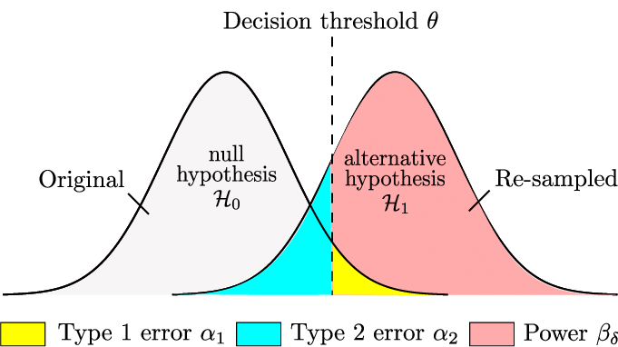

Estadística Computacional
===

### Test de Hipótesis
###### Braulio Fuentes - Diego Quezada

---
# Temario
- Introducción.
- Hipótesis
- Procedimientos de Test.
    - Test para la media.
    - Test para una proporción de población.
    - Test para la varianza.
    - Valores $P$.

---

# Introducción

Una *hipótesis estadísticas* es una aseveración o conjetura con respecto a una o más poblaciones. La verdad o falsedad de una hipótesis estadística nunca se sabe con absoluta certidumbre, a menos que examinemos toda la población. En cambio, tomamos una muestra aleatoria de la población de interés, y utilizamos los datos contenidos en esta muestra para proporcionar evidencia que apoye o no la hipótesis. 

---
# Hipótesis.

* Se conoce como hipótesis nula, $H_0$, a la pretensión que inicialmente se supone cierta, **creencia previa**. Mientras aquella aseveración que contradice a esta ultima se concoe como hipótesis alternativa.

* $H_0$ será rechazada en favor de la hipótesis alternativa sólo si la evidencia muestral sugiere que es falsa.

* Si la muestra no contradice fuertemente a $H_0$, se dice que no existe suficiente información para rechazar $H_0$.

> Una prueba de hipótesis es un método de utilizar datos muestrales para decidir si la hipótesis nula debe ser rechazada. :nerd_face:

---
# Procedimientos de Prueba.

Un procedimiento de prueba consiste en:

1. Un **estadístico de prueba**, una función de los datos muestrales en los cuales ha de basarse la decisión.
2. Una **región de critica**, el conjunto de todos los valores estadísticos de prueba por los cuales $H_0$ será rechazada. El último número que observamos al pasar a la región crítica se llama  valor crítico. 

> La hipótesis nula *será rechazada* entonces si y sólo si el estadístico de prueba calculado queda en la región de critica. :dizzy_face:

---
# Errores en el Test de Hipótesis.

Un procedimiento de prueba podría conducir a dos conclusiones erróneas.

- Un *error de tipo I* o nivel de significancia consiste en rechazar $H_0$ cuando es verdadera ($\alpha$).
- Un *error de tipo II* implica no rechazar $H_0$ cuando es falsa. ($\beta$)
- Los errores están relacionados, una disminución en la probabilidad de uno produce un incremento en la probabilidad del otro.

***
- Un aumento en el tamaño muestral $n$  reducirá a $\alpha$ y $\beta$ de forma simultánea.

- La **potencia** es la probabilidad $H_0$ sea rechazada cuando la hipótesis alternativa es verdadera ($1-\beta$).

> $\beta$ es imposible de calcular a menos que tengamos una hipótesis alternativa específica. :muscle:

---
# Tipos de Prueba.
El método más usado es una prueba de hipótesis con probabilidad fija del error tipo I:

1. Establezca las hipótesis nula y alternativa.
2. Elija un nivel de significancia  $\alpha$  fijo.
3. Seleccione un estadístico de prueba adecuado y establezca la región crítica con base en  $\alpha$.
4. A partir del estadístico de prueba calculado, rechace  $H_0$  si el estadístico de prueba está  en la región crítica. De otra manera, no rechace $H_0$.

***
## Pruebas sobre una media de población

### Una población normal con $\sigma$ conocida.
$$
\begin{align*}
\text{Hipótesis nula:} &\quad H_{0}: \mu=\mu_{0}\\
\text{Estadístico de prueba:} &\quad \displaystyle z=\frac{\overline{x}-\mu_{0}}{\sigma/\sqrt{n}}\\
\text{Hipótesis alternativa} &\qquad \text{Región de rechazo para la prueba de nivel $\alpha$}\\
    H_{a}: \mu>\mu_{0} &\qquad z\ge z_{1-\alpha} \quad \text{(prueba de cola superior)}\\
    H_{a}: \mu<\mu_{0} &\qquad z\le z_{\alpha} \quad \text{(prueba de cola inferior)}\\
    H_{a}: \mu\neq \mu_{0} &\qquad z\ge z_{1-\alpha/2}\text{ o } z\le z_{\alpha/2} \quad \text{(prueba dos colas)}
\end{align*}
$$
***
* **Error de Tipo II**
    $$
    \begin{align*}
    \text{Hipótesis alternativa} &\qquad \text{Probabilidad de error de tipo II para una prueba de nivel $\alpha$}\\
        H_{a}: \mu>\mu_{0} &\qquad \Phi\left(z_{1-\alpha} + \frac{\mu_{0}-\mu'}{\sigma/\sqrt{n}} \right) \\
        H_{a}: \mu<\mu_{0} &\qquad 1-\Phi\left(z_{\alpha} + \frac{\mu_{0}-\mu'}{\sigma/\sqrt{n}} \right) \\
        H_{a}: \mu\neq \mu_{0} &\qquad \Phi\left(z_{1-\alpha/2} + \frac{\mu_{0}-\mu'}{\sigma/\sqrt{n}} \right)-\Phi\left(z_{\alpha/2} + \frac{\mu_{0}-\mu'}{\sigma/\sqrt{n}} \right)
    \end{align*}
    $$

* **Tamaño de la muestra**
  El tamaño de una muestra $n$ con el cual una prueba de nivel $\alpha$ también tiene $\beta$ con unn valor alternativo $\mu'$ es:
  $$
    \begin{equation*}
        n=\begin{cases}\displaystyle
        \left[\frac{\sigma(z_{1-\alpha}+z_{1-\beta})}{\mu_{0}-\mu'}\right]^2 & \text{para una prueba de una cola}\\\displaystyle
        \left[\frac{\sigma(z_{1-\alpha/2}+z_{1-\beta})}{\mu_{0}-\mu'}\right]^2 & \text{para una prueba de dos cola}
        \end{cases}
    \end{equation*}
  $$
***
### Pruebas con muestras grandes

Para este caso usamos el estadístico de prueba:
$$
    z=\frac{\overline{x}-\mu_{0}}{s/\sqrt{n}}
$$

Se utilizará de nuevo la regla empírica $n > 40$ para caracterizar un tamaño de muestra grande.
***
### Una población normal con $\sigma$ desconocida
$$
\begin{align*}
\text{Hipótesis nula:} &\quad H_{0}: \mu=\mu_{0}\\
\text{Estadístico de prueba:} &\quad \displaystyle t=\frac{\overline{x}-\mu_{0}}{s/\sqrt{n}}\\
\text{Hipótesis alternativa} &\qquad \text{Región de rechazo para la prueba de nivel $\alpha$}\\
    H_{a}: \mu>\mu_{0} &\qquad t\ge t_{1-\alpha,n-1} \quad \text{(prueba de cola superior)}\\
    H_{a}: \mu<\mu_{0} &\qquad t\le t_{\alpha,n-1} \quad \text{(prueba de cola inferior)}\\
    H_{a}: \mu\neq \mu_{0} &\qquad t\ge t_{1-\alpha/2,n-1}\text{ o } t\le t_{\alpha/2,n-1} \quad \text{(prueba dos colas)}
\end{align*}
$$
***
### Pruebas con una proporción de población
$$
\begin{align*}
\text{Hipótesis nula:} &\quad H_{0}: p=p_{0}\\
\text{Estadístico de prueba:} &\quad \displaystyle z=\frac{\hat{p}-p_{0}}{\sqrt{p_{0}(1-p_{0})/n}}\\
\text{Hipótesis alternativa} &\qquad \text{Región de rechazo para la prueba de nivel $\alpha$}\\
H_{a}: p>p_{0} &\qquad z\ge z_{1-\alpha} \quad \text{(prueba de cola superior)}\\
H_{a}: p<p_{0} &\qquad z\le z_{\alpha} \quad \text{(prueba de cola inferior)}\\
H_{a}: p\neq p_{0} &\qquad z\ge z_{1-\alpha/2}\text{ o } z\le z_{\alpha/2} \quad \text{(prueba dos colas)}
\end{align*}
$$

***
* **Error de Tipo II**
$$
\begin{align*}
\text{Hipótesis alternativa} &\qquad \text{Probabilidad de error de tipo II $\beta(p')$ para una prueba de nivel $\alpha$}\\
H_{a}: p>p_{0} &\qquad \Phi\left[\frac{p_{0}-p'+z_{1-\alpha}\sqrt{p_{0}(1-p_{0})/n}}{\sqrt{p'(1-p')/n}} \right] \\
H_{a}: p<p_{0} &\qquad 1-\Phi\left[\frac{p_{0}-p'+z_{1-\alpha}\sqrt{p_{0}(1-p_{0})/n}}{\sqrt{p'(1-p')/n}} \right] \\
H_{a}: p\neq p_{0} &\qquad \Phi\left[\frac{p_{0}-p'+z_{1-\alpha/2}\sqrt{p_{0}(1-p_{0})/n}}{\sqrt{p'(1-p')/n}} \right]-\Phi\left[\frac{p_{0}-p'+z_{\alpha/2}\sqrt{p_{0}(1-p_{0})/n}}{\sqrt{p'(1-p')/n}} \right]
\end{align*}
$$

* **Tamaño de la muestra**
El tamaño de una muestra $n$ con el cual una prueba de nivel $\alpha$ también tiene $\beta$ con un valor alternativo $p'$ es:
$$
\begin{equation*}
n=\begin{cases}\displaystyle
\left[\frac{(z_{1-\alpha}\sqrt{p_{0}(1-p_{0})}+z_{1-\beta}\sqrt{p'(1-p')})}{p'-p_{0}}\right]^2 & \text{para una prueba de una cola}\\\displaystyle
\left[\frac{(z_{1-\alpha/2}\sqrt{p_{0}(1-p_{0})}+z_{1-\beta}\sqrt{p'(1-p')})}{p'-p_{0}}\right]^2 & \text{para una prueba de dos cola}
\end{cases}
\end{equation*}
$$

***
### Pruebas con una varianza de población.
$$
\begin{align*}
\text{Hipótesis nula:} &\quad H_{0}: \sigma^{2}=\sigma_{0}^{2}\\
\text{Valor del estadístico de prueba:} &\quad \displaystyle \chi^2=\frac{(n-1)s^2}{\sigma_{0}^{2}}\\
\text{Hipótesis alternativa} &\qquad \text{Región de rechazo para la prueba de nivel $\alpha$}\\
H_{a}: \sigma^{2}>\sigma_{0}^{2} &\qquad \chi^2\ge \chi_{1-\alpha,n-1}^2 \quad \text{(prueba de cola superior)}\\
H_{a}: \sigma^{2}<\sigma_{0}^{2} &\qquad \chi^2\le \chi_{\alpha,n-1}^2 \quad \text{(prueba de cola inferior)}\\
H_{a}: \sigma^{2}\neq\sigma_{0}^{2} &\qquad \chi^2\ge \chi_{1-\alpha/2,n-1}^2\text{ o } \chi^2\le \chi_{\alpha/2,n-1}^2 \quad \text{(prueba dos colas)}
\end{align*}
$$

---
# Tipos de Prueba.
Otro método seguido es una prueba de significancia, aproximación al valor $P$:

1. Establezca las hipótesis nula y alternativa.
2. Elija un estadístico de prueba adecuado.
3. Calcule el valor  $P$  con base en los valores calculados del estadístico de prueba.
4. Utilice el juicio con base en el valor  $P$.

---
# Valores $P$.
El nivel de significación observado, $P$, es el nivel de significación más pequeño al cual $H_{0}$ sería rechazada.
Una vez que se ha determinado el valor $P$, la conclusión a un nivel particular $\alpha$ resulta de comparar el valor $P$ con $\alpha$: 

- $$\text{Valor }P \le \alpha: \text{rechazar } H_{0} \text{ al nivel } \alpha.$$

- $$\text{Valor }P > \alpha: \text{no rechazar } H_{0} \text{ al nivel } \alpha.$$

***
## Valor de $P$ para una distribución cualquiera.
Dado un estadístico de prueba $x$ que sigue una distribución $X$, el valor $P$ se calcula de la siguiente forma dependiendo del test: 

$$
P=\begin{cases}
P(X\ge x) & \text{para una test de cola superior}\\
P(X\le x) & \text{para una test de cola inferior}\\
2\cdot P(X\ge x) & \text{para una test de dos colas}
\end{cases}
$$

> Generalmente, cuando $P$ es un valor muy pequeño se rechaza la hipótesis nula. :shushing_face:

