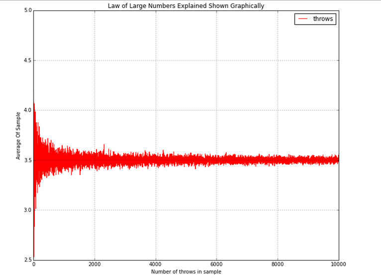

Estadística Computacional
===

### Distribuciones muestrales
###### Braulio Fuentes - Diego Quezada

---
# Temario
- Introducción
- Tipos de convergencia
    - En probabilidad
    - En distribución
- Teoremas
    - Ley débil de los grandes números
    - Ley fuerte de los grandes números
    - Teorema del límite central
- Otros resultados interesantes

---
# Introducción
- Hemos trabajado asumiendo que los datos disponibles conforman la población.
- Ahora estudiaremos el comportamiento de una secuencia de variables $X_1,X_2, \dots, X_n$ a medida que $n \rightarrow \infty$.
- Trabajaremos bajo los siguientes supuestos:
    1. $X_n$ es una muestra aleatoria simple (MAS).
    2. $X_n$ está conformada por variables aleatorias independientes e identicamente distribuidas (IID). 

---

- Sea $X_n$ una muestra IID donde $\mu = E[X_i]$ y $\sigma^2 = V[X_i]$ para cada $i$:

$$
E[\overline{X}_n] = E[\frac{1}{n}\sum_{i = 0}^n X_i] = \frac{1}{n} E[\sum_{i = 0}^n X_i] = \frac{1}{n} \cdot (n \mu) = \mu
$$

$$
V[\overline{X}_n]
 = V[\frac{1}{n} \sum_{i = 0}^n X_i] = \frac{1}{n^2} V[ \sum_{i = 0}^n X_i] = \frac{1}{n^2}\sum_{i = 0} ^n {V[X_i]}  = \frac{1}{n^2} \cdot n \sigma^2 = \frac{\sigma^2}{n}
$$

> Recordando:
$$
V(X \pm Y ) = V(X) + V(Y ) \pm 2\cdot Cov(X,Y)
$$

---
# Tipos de convergencia

Sea $X_n$ una secuencia de variables aleatorias, y sea $X$ otra variable aleatoria. Denotemos $F_n$ a la cdf de $X_n$ y $F$ a la cdf de $X$.

## Convergencia en probabilidad

$X_n$ converge a $X$ en probablidad: Se denota $X_n \xrightarrow{P} X$ si para todo $\epsilon > 0$ se cumple:

$$
P(\lim_{n \rightarrow \infty} |X_n - X| > \epsilon) = 0
$$

---
## Convergencia en distribución

$X_n$ converge a $X$ en distribución: Se denota $X_n  \rightsquigarrow X$ si para todo $t$ para el cual $F$ es continua se cumple:

$$
\lim_{n \rightarrow \infty} F_n(t) = F(t)
$$
---
# Teoremas
## Ley débil de los grandes números

Sea $X_n$ una muestra IID donde  $\mu = E[X_i]$ y $\sigma^2 = V[X_i]$.
El promedio muestral $\overline{X}_n$ **converge en probabilidad** a $\mu$, es decir:

$$
P(\lim_{n \rightarrow \infty} |\overline{X}_n - \mu| < \epsilon) = 1
$$

---
## Ley fuerte de los grandes números
Sea $X_n$ una muestra IID donde  $\mu = E[X_i] < \infty$ .
El promedio muestral $\overline{X}_n$ **converge casi seguramente** a $\mu$, es decir:

$$
P(\lim_{n \rightarrow \infty} \overline{X}_n = \mu) = 1
$$

> Investigar sobre convergencia "almost sure", $L_1$ y $L_2$
---
## Teorema del límite central (TCL)
Sea $X_n$ una muestra IID donde $\mu = E[X_i]$  y $\sigma^2 = V[X_i]$.
Entonces $\overline{X}_n \rightsquigarrow N(\mu, \frac{\sigma^2}{n})$, a medida que $n \rightarrow \infty$ **independiente de la distribución de la muestra**.

### Normalización

$$
Z_n = \frac{\overline{X}_n - \mu}{\sqrt{V(\overline{X}_n)}} = \frac{\sqrt{n}}{\sigma} (\overline{X}_n - \mu) \rightsquigarrow N(0,1)
$$

> Declaraciones de probabilidad sobre $\overline{X}_n$ pueden ser aproximadas utilizando una distribucion normal :bulb:.
---
### Estimadores

Si no conocemos ni la media ni la varianza podemos utilizar estimadores muestrales para el TCL.

Hay que estar consciente que los resultados solo serán aproximaciones de aproximaciones.

---
#### Estimador de $\sigma^2$

En la siguiente unidad podremos estimar la varianza poblacional mediante la muestra como:

$$
S_{n-1}^2 = \frac{1}{n - 1}\sum^n_i(X_i - \overline{X}_i)^2
$$

Además, si $X_i \sim N(\mu, \sigma^2)$ sabemos:

$$
\frac{(n-1) S_{n-1}^2}{\sigma^2} \sim \chi^2(n-1)
$$

---
# Otros resultados interesantes

## Desiguladad de Markov

Sea $X$  una variable aleatoria sobre $\R^+$, se sabe que:

$$
\forall a> 0, \space P(X \geq a) \leq \frac{E[X]}{a}
$$

---

## Desiguladad de Chebyshev

Sea  $X$ una variable aleatoria tal que $E[X] = \mu$ y $V[X] = \sigma^2$, se sabe que:

$$
\forall k > 0, \space P(|X - \mu| > k ) \leq \frac{\sigma^2}{k^2}
$$

> Usando esta desigualdad se puede demostrar el TCL :bulb:
---

# Ejercicio propuesto

Suponga el número de errores por programa sigue una distribución de poisson con $\lambda = 5$. Tenemos 125 programas. 
Sean $X_1, X_2, \dots, X_{125}$ el número de errores en los programas, aproxime $P(\overline{X}_n \leq 5.5)$